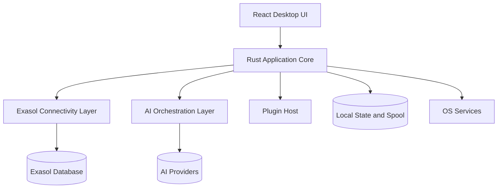

# Exasol Studio Architecture

Related documents:

- [requirements.md](./requirements.md)
- [design.md](./design.md)
- [tasks.md](./tasks.md)
- [graphify/README.md](./graphify/README.md)
- [adr](./adr)

## 1. System Architecture

Exasol Studio uses a layered desktop architecture:

1. Presentation Layer: React, TypeScript, TailwindCSS, Monaco, UI composition
2. Application Layer: Rust orchestration, workspace state, command routing, policies, jobs
3. Integration Layer: Exasol connectivity, AI providers, plugin host, file and OS integrations
4. Infrastructure Layer: keychain, local SQLite state, spool files, updater, logging, notifications



## 2. Module Architecture

### Frontend Modules

- `app-shell`
- `connections`
- `explorer`
- `editor`
- `results`
- `monitoring`
- `import-export`
- `ai`
- `settings`
- `extensions`
- `shared-ui`

### Rust Modules

- `local_runtime` (native Exasol Personal lifecycle on macOS; Docker/Podman Exasol Nano lifecycle on Windows/Linux)
- `local_database` (first-install component state, vault-backed profile, Semantic Views bootstrap)
- `workspace_store`
- `command_bus`
- `job_manager`
- `safety_engine`
- `credential_bridge`
- `result_spool`
- `plugin_host`
- `diagnostics`

### Integration Modules

- `exasol_driver_adapter`
- `metadata_adapter`
- `import_export_adapter`
- `ai_provider_adapters`
- `mcp_adapter`

## 3. Service Interactions

- UI never talks directly to the database.
- Rust core is the orchestration boundary for commands, events, and policies.
- The Exasol connectivity layer is responsible for queries, metadata, and operational database work.
- AI orchestration can request metadata and read-only result context through controlled tool routes.
- Plugins operate through explicit contracts mediated by the backend.

## 4. Repository Structure Recommendation

```text
repo/
  apps/
    desktop/
      src/
      src-tauri/
  crates/
    app-core/
    workspace-store/
    safety-engine/
    result-spool/
    plugin-host/
    diagnostics/
  services/
    exasol-driver-service/
  packages/
    shared-types/
    sql-language/
    design-tokens/
  docs/
    foundation/
    adr/
    graphify/
  tests/
    e2e/
    fixtures/
```

## 5. Layered Architecture and Boundaries

### Presentation Layer

- owns rendering, interaction state, and view composition
- does not own connection secrets, direct SQL execution, or provider credentials

### Application Layer

- owns workflow orchestration, event routing, policy enforcement, and persistence coordination

### Integration Layer

- owns external system calls and protocol adapters

### Infrastructure Layer

- owns device-specific and host-specific capabilities

## 6. Design Patterns

- Command pattern for UI-to-core requests
- Event-driven architecture for job and workflow progress
- Adapter pattern for Exasol ecosystem integrations and AI providers
- Policy gateway for AI, plugin, and destructive execution approvals
- Repository pattern for local persisted state
- Capability negotiation for object support and feature visibility

## 7. Technology Decisions

### Desktop Shell

- Tauri v2 is chosen for native integration, smaller footprint, and Rust alignment.

### UI

- React and TypeScript are chosen for composable workbench UX and maintainable UI contracts.

### Editor

- Monaco is chosen for mature editor behavior and language-service integration potential.

### Backend

- Rust is chosen for desktop orchestration, safety, and predictable performance.

### Connectivity

- Initial recommendation: dedicated Exasol driver service boundary.
- Rationale: strong isolation, better control over streaming, cancellation, and feature completeness.

### AI

- Provider abstraction is required from day one.
- Rationale: `SKILL.md` explicitly points to multiple AI-adjacent Exasol patterns and providers.

## 8. Integration Points

### Core Exasol Integrations

- drivers and official connectivity docs
- Exasol MCP Server
- Exasol Personal and Docker DB for local environments
- Exasol Testcontainers or equivalent integration harness

### Ecosystem-Informed Integration Targets

- Virtual Schemas
- Cloud Storage Extension
- Lakehouse Turbo
- `exapump`
- `exarrow-rs`
- `exasol-json-tables`
- Terraform Provider
- scheduler and governance patterns

### Human and AI Surfaces

- AI provider APIs
- MCP-based tools
- future semantic layer integrations

## 9. Deployment Architecture

### Development

- local desktop app
- local config and keychain
- Exasol Personal or Docker DB

### CI

- lint and type checks
- Rust unit and integration tests
- frontend tests
- end-to-end flows against disposable Exasol test environment

### Production/Desktop Distribution

- signed desktop builds for macOS, Windows, and Linux
- bundled or managed driver-side runtime
- Studio-owned local setup installs/resumes in the background: native Exasol
  Personal on macOS or Exasol Nano through Docker/Podman on Windows/Linux,
  followed by PyExasol, Semantic Views, ExaPump, MCP server, and agent skills;
  it auto-starts on later launches and exposes durable loading/ready/failed state
- in-app updater with policy controls

## 10. Future Extensibility

- plugin contribution model for UI panels and adapters
- managed enterprise policy overlays
- team collaboration and approvals
- semantic layer and metadata enrichment
- advanced platform administration surfaces

## 11. ADR Index

- [ADR-0001: Exasol-first product scope](./adr/ADR-0001-exasol-first-scope.md)
- [ADR-0002: Tauri plus Rust desktop architecture](./adr/ADR-0002-tauri-rust-desktop.md)
- [ADR-0003: Driver service boundary for Exasol connectivity](./adr/ADR-0003-driver-service-boundary.md)
- [ADR-0004: Governed AI action model](./adr/ADR-0004-governed-ai-action-model.md)
- [ADR-0005: Studio-owned local runtime and first-install stack](./adr/ADR-0005-studio-owned-local-runtime.md)

## 12. Architectural Recommendations and Gaps

- The source material is rich on ecosystem tools but light on end-user desktop architecture. This suite fills that gap by defining a bounded desktop platform model.
- `SKILL.md` mixes official and Labs tooling intentionally. Product integrations must preserve those support distinctions in code and UI.
- The architecture should start Exasol-only. A premature generic multi-database core would increase complexity without supporting the business goal.

## 13. Review Notes

- Completeness check: system, modules, interactions, repository, layering, patterns, decisions, integration points, deployment, extensibility, and ADRs are covered.
- Consistency check: aligns with the requirements and design documents.
- Clean Architecture check: business workflows and policies stay above infrastructure concerns.
