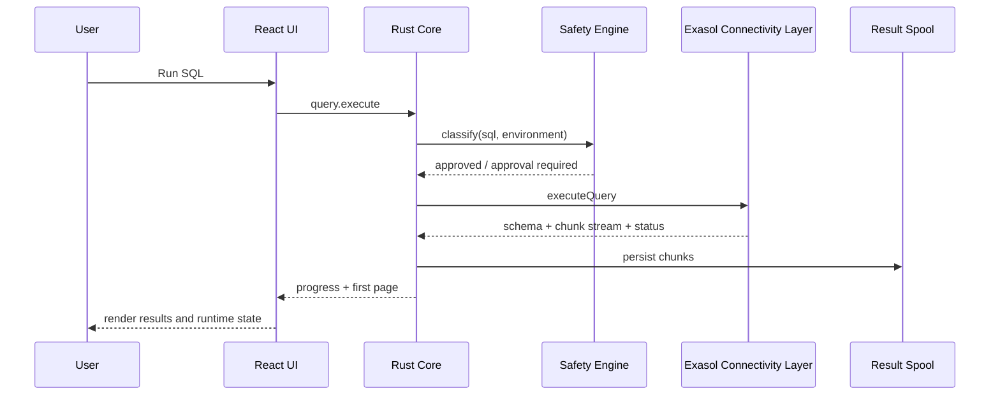
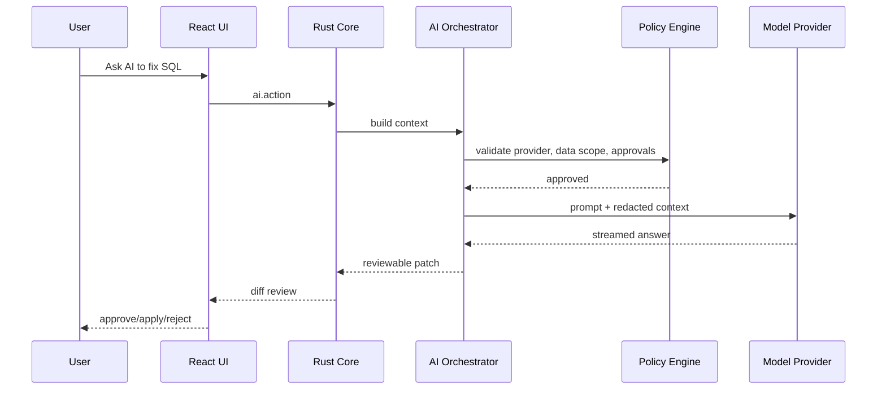

# Exasol Studio Design

Related documents:

- [requirements.md](./requirements.md)
- [architecture.md](./architecture.md)
- [tasks.md](./tasks.md)
- [graphify/README.md](./graphify/README.md)

## 1. Design Intent

Translate the product requirements into an implementation-oriented design for a desktop-native Exasol workbench with AI-assisted workflows and future-safe extension boundaries.

## 2. High-Level Design

Exasol Studio is composed of five primary runtime zones:

1. React desktop UI for shell, editors, results, panels, and workflows
2. Rust application core for orchestration, persistence, security boundaries, and eventing
3. Exasol connectivity layer for execution, metadata, imports/exports, and diagnostics
4. AI orchestration layer for provider abstraction, safety, context assembly, and tool routing
5. Extension and integration layer for plugins, provider adapters, visualizations, and ecosystem workflows

The design intentionally separates user experience concerns from database communication concerns. Large result handling, credential management, and long-running operations are kept away from the webview where possible.

## 3. Low-Level Design

### UI Shell

- Activity bar, sidebars, status bar, command palette, and notification center
- Editor workbench with SQL consoles, notebooks, DDL previews, and diff views
- Bottom-panel system for results, logs, history, jobs, and diagnostics
- Right-side assistant and inspector surfaces

### Rust Core

- `WorkspaceStore`: layout, open files, recent activity, query history metadata, preferences
- `CommandBus`: typed requests and events between webview, backend, and integration services
- `SafetyEngine`: environment classification, SQL risk analysis, approval requirements
- `JobManager`: long-running imports, exports, background refreshes, AI actions
- `CredentialBridge`: keychain access and secure token handling
- `ResultSpool`: file-backed or database-backed storage for large result sets

### Connectivity Layer

- `ConnectionRegistry`
- `MetadataService`
- `QueryService`
- `ImportExportService`
- `MonitoringService`
- `CapabilityResolver`

### AI Layer

- `ProviderRegistry`
- `ContextBuilder`
- `PromptTemplateRegistry`
- `PolicyEngine`
- `RedactionService`
- `ToolRouter`
- `ActionAuditLog`

### Extension Layer

- internal extension manifests
- provider adapters
- visualization adapters
- import/export adapters
- inspector contributions

## 4. Component Design

### SQL Workbench Component Set

- `SqlEditorPane`
- `ExecutionToolbar`
- `ResultTabs`
- `ResultGrid`
- `PlanViewer`
- `ProblemList`
- `QueryHistoryPanel`

### Explorer and Metadata Component Set

- `ConnectionTree`
- `ObjectInspector`
- `ObjectDDLView`
- `DependencyGraphPanel`
- `PrivilegeMatrixView`

### AI Component Set

- `AssistantSidebar`
- `InlineAiActionBar`
- `AiReviewDialog`
- `AiContextPreview`
- `AiRunTimeline`

### Administration Component Set

- `SessionManager`
- `LockMonitor`
- `ImportWizard`
- `ExportWizard`
- `ConnectionManager`

## 5. API Design

Studio should use typed internal APIs between UI and Rust, not direct ad hoc calls.

### Internal Command API Examples

```ts
type ExecuteSqlCommand = {
  type: "query.execute";
  connectionId: string;
  editorId: string;
  sql: string;
  selection?: { start: number; end: number };
  mode: "statement" | "selection" | "script" | "explain";
  safetyContext: {
    environment: "dev" | "staging" | "prod";
    requireApproval: boolean;
  };
};
```

```ts
type AiActionRequest = {
  type: "ai.action";
  action:
    | "generate_sql"
    | "explain_sql"
    | "fix_error"
    | "summarize_schema"
    | "draft_import_plan";
  contextIds: string[];
  providerProfileId: string;
  approvalMode: "silent" | "review_required";
};
```

### Service Contracts

- `connect()`, `disconnect()`, `testConnection()`
- `loadTreeNode()`, `searchMetadata()`, `getObjectDdl()`, `getDependencies()`
- `executeQuery()`, `cancelQuery()`, `fetchResultPage()`
- `createImportPlan()`, `runImportJob()`, `runExportJob()`
- `startAiAction()`, `reviewAiPatch()`, `applyAiPatch()`

## 6. AI and Agent Design

The design adopts the Exasol ecosystem guidance from `SKILL.md`:

- prefer official docs and official repositories where possible
- clearly distinguish official, Labs, and third-party integrations
- treat MCP, semantic grounding, governance, and least privilege as first-class concerns

### AI Design Principles

- AI is contextual, not ambient
- generated SQL is reviewable before execution
- read-only paths are preferred by default
- prompts and outputs are auditable
- schema grounding is preferred over table-name guessing

### Agent-Aware Integration Design

Exasol Studio should integrate with:

- Exasol MCP Server for governed assistant workflows
- Text-to-SQL MCP patterns for experimental read-only workflows
- `exasol-agent-skills` as reference material for AI coding and operator agents
- semantic layer patterns for business-grounded querying

## 7. Data Flow

### Query Execution Flow



### AI Action Flow



## 8. Error Handling Strategy

- classify errors by domain: connection, auth, authorization, SQL syntax, runtime execution, import/export, AI, plugin, workspace, update
- show user-facing summary first and deep diagnostics second
- never discard failed SQL or operation context
- allow recovery actions: retry, reconnect, open docs, ask AI, export logs, copy statement
- preserve backend job state even if frontend view is closed

## 9. Security Considerations

- all secrets are brokered through a secure credential bridge
- AI context redaction happens before provider invocation
- webview code never receives raw keychain handles or unrestricted system permissions
- plugin permissions are explicit and reviewable
- production connections surface environment labels and destructive action gates

## 10. Scalability Strategy

- lazy-load metadata and virtualize tree nodes
- chunk and spool results instead of keeping full datasets in memory
- isolate long-running database and AI work into jobs
- treat the connectivity layer as restartable and independently observable
- support future multi-window and multi-agent workflows through a typed event model

## 11. Maintainability Guidelines

- preserve feature-oriented module boundaries
- keep UI state, backend orchestration, and database logic separate
- codify contracts in shared types and test fixtures
- favor stable extension interfaces over direct feature-to-feature coupling
- record non-obvious decisions as ADRs before deep implementation

## 12. Performance Considerations

- avoid JSON-heavy transport for large result payloads
- prefer binary or file-backed chunk exchange for large result pages
- debounce expensive metadata searches
- keep editor semantics incremental and threshold-aware
- use background indexing and refresh jobs instead of blocking UI actions

## 13. Testing Strategy

- unit tests for Rust services, SQL safety classification, provider policies, redaction, and command contracts
- component tests for editor, tree, results, settings, and AI review surfaces
- integration tests against Exasol Personal, Docker DB, or Testcontainers-backed environments
- end-to-end tests for core user workflows
- regression tests for generated SQL and AI-reviewed patches

## 14. Recommended Improvements Over Source Inputs

- Use `exarrow-rs` as a future optimization and ecosystem integration point, not the sole initial connectivity strategy.
- Favor an explicit driver service boundary early. It keeps the desktop shell cleaner and lowers blast radius for connectivity issues.
- Use Exasol Labs integrations selectively and label them clearly in the product and docs.
- Treat `exasol-vscode` and `mcp-server` as reference implementations and integration models, not as architecture to mirror blindly.

## 15. Review Notes

- Completeness check: high-level, low-level, components, APIs, flows, security, scalability, maintainability, performance, and testing are present.
- Consistency check: design aligns with requirements and the Exasol-first product direction.
- Duplication cleanup: product vision details stay in the product spec; this document stays implementation-oriented.

