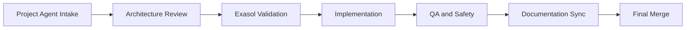

# Agent Workflow Graph

```mermaid
flowchart LR
  Intake[Project Agent Intake]
  Arch[Architecture Review]
  Exasol[Exasol Validation]
  Build[Implementation]
  QA[QA and Safety]
  Docs[Documentation Sync]
  Merge[Final Merge]

  Intake --> Arch
  Arch --> Exasol
  Exasol --> Build
  Build --> QA
  QA --> Docs
  Docs --> Merge
```

