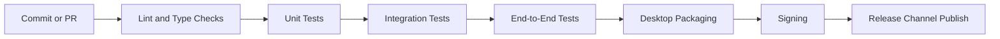

# CI/CD Workflow Graph

```mermaid
flowchart LR
  Commit[Commit or PR]
  Static[Lint and Type Checks]
  Unit[Unit Tests]
  Integration[Integration Tests]
  E2E[End-to-End Tests]
  Package[Desktop Packaging]
  Sign[Signing]
  Release[Release Channel Publish]

  Commit --> Static
  Static --> Unit
  Unit --> Integration
  Integration --> E2E
  E2E --> Package
  Package --> Sign
  Sign --> Release
```

