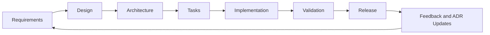

# Development Lifecycle Graph

```mermaid
flowchart LR
  Requirements[Requirements]
  Design[Design]
  Architecture[Architecture]
  Tasks[Tasks]
  Build[Implementation]
  Validate[Validation]
  Release[Release]
  Learn[Feedback and ADR Updates]

  Requirements --> Design
  Design --> Architecture
  Architecture --> Tasks
  Tasks --> Build
  Build --> Validate
  Validate --> Release
  Release --> Learn
  Learn --> Requirements
```

