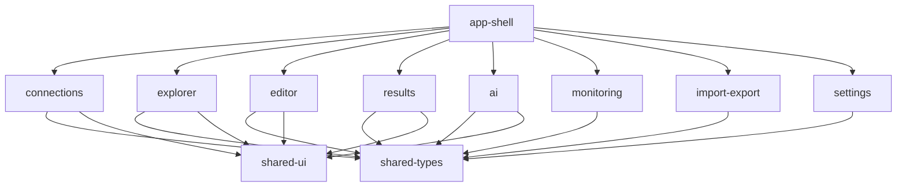

# Module Dependencies Graph

```mermaid
flowchart TD
  Shell[app-shell]
  Connections[connections]
  Explorer[explorer]
  Editor[editor]
  Results[results]
  AI[ai]
  Monitor[monitoring]
  ImportExport[import-export]
  Settings[settings]
  Shared[shared-ui]
  Types[shared-types]

  Shell --> Connections
  Shell --> Explorer
  Shell --> Editor
  Shell --> Results
  Shell --> AI
  Shell --> Monitor
  Shell --> ImportExport
  Shell --> Settings
  Connections --> Types
  Explorer --> Types
  Editor --> Types
  Results --> Types
  AI --> Types
  Monitor --> Types
  ImportExport --> Types
  Settings --> Types
  Connections --> Shared
  Explorer --> Shared
  Editor --> Shared
  Results --> Shared
  AI --> Shared
```

