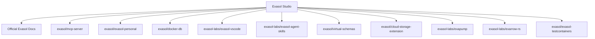

# Repository Relationships Graph

```mermaid
flowchart TB
  Studio[Exasol Studio]
  Docs[Official Exasol Docs]
  MCP[exasol/mcp-server]
  Personal[exasol/exasol-personal]
  Docker[exasol/docker-db]
  VS[exasol-labs/exasol-vscode]
  AgentSkills[exasol-labs/exasol-agent-skills]
  VirtualSchemas[exasol/virtual-schemas]
  CloudStorage[exasol/cloud-storage-extension]
  Exapump[exasol-labs/exapump]
  Exarrow[exasol-labs/exarrow-rs]
  Testcontainers[exasol/exasol-testcontainers]

  Studio --> Docs
  Studio --> MCP
  Studio --> Personal
  Studio --> Docker
  Studio --> VS
  Studio --> AgentSkills
  Studio --> VirtualSchemas
  Studio --> CloudStorage
  Studio --> Exapump
  Studio --> Exarrow
  Studio --> Testcontainers
```

