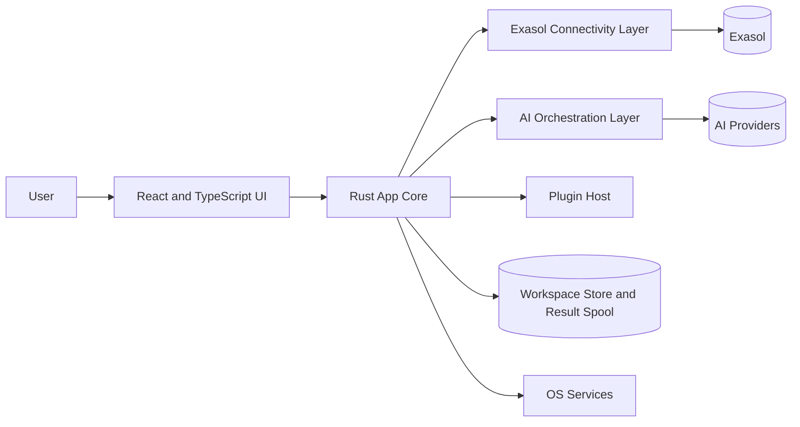

# System Architecture Graph

```mermaid
flowchart LR
  User[User]
  UI[React and TypeScript UI]
  Core[Rust App Core]
  Driver[Exasol Connectivity Layer]
  AI[AI Orchestration Layer]
  Plugin[Plugin Host]
  Store[(Workspace Store and Result Spool)]
  OS[OS Services]
  Exasol[(Exasol)]
  Provider[(AI Providers)]

  User --> UI
  UI --> Core
  Core --> Driver
  Core --> AI
  Core --> Plugin
  Core --> Store
  Core --> OS
  Driver --> Exasol
  AI --> Provider
```

